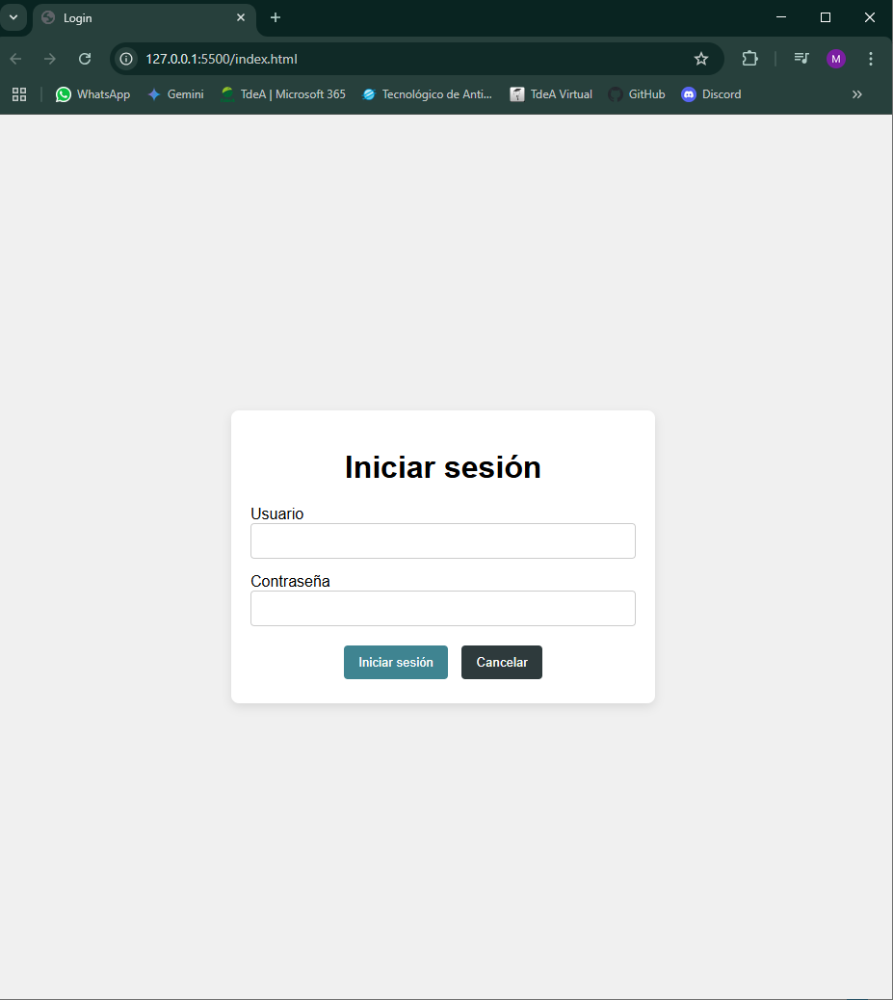

# bank-ui

Inicio de sesión (login) utilizando HTML, CSS y JavaScript. El proyecto cuenta con una interfaz de usuario para la autenticación, validación de formularios, almacenamiento en `localStorage` y manejo de sesión.

## Tecnologías utilizadas

- **HTML5**
- **CSS3**
- **JavaScript (ES6+)**

## Instrucciones de instalación

Clona este repositorio a tu máquina local:

   ```bash
   git clone https://github.com/tuusuario/tu-repositorio.git
   cd tu-repositorio

   Abre el archivo index.html
   ```


