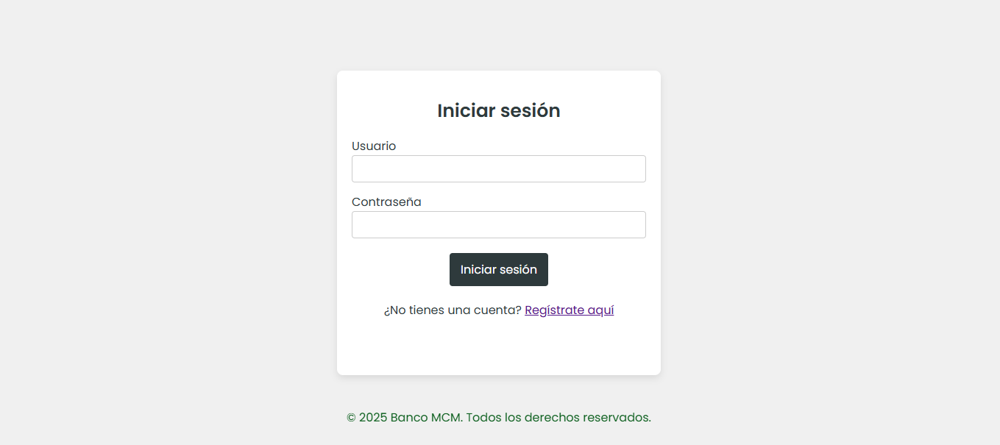
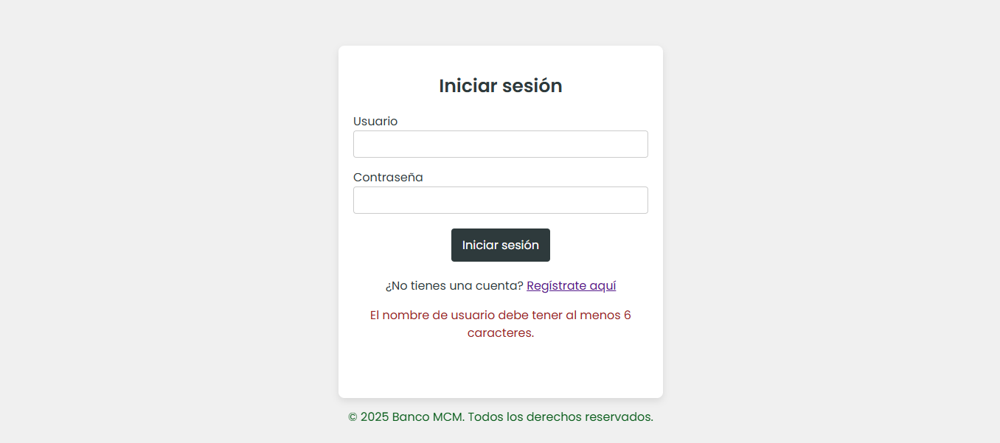
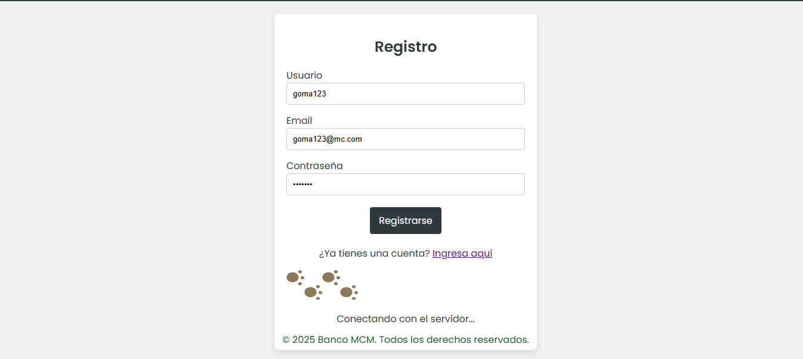
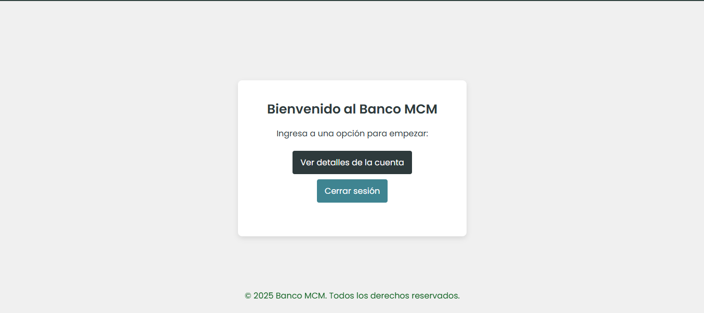
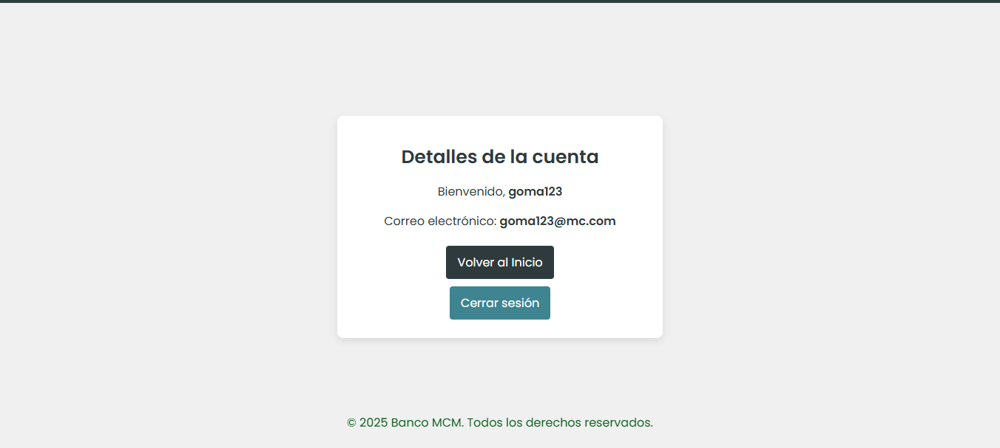

# bank-ui

Registro (signup) e Inicio de sesión (login). Está basado en **Express.js**, utiliza **express-session** para la gestión de sesiones, **socket.io** para la implementación de actulizaciones en tiempo real y **Axios** para realizar solicitudes HTTP a un servidor externo de autenticación.

## Tecnologías utilizadas

- **NodeJS**
- **ExpressJS**
- **Socket.io**
- **Axios**
- **ejs**
- **CSS3**
- **JavaScript (ES6+)**

## Instrucciones de instalación

Clona este repositorio a tu máquina local:

   ```bash
   git clone https://github.com/mcamimejia/bank-ui.git
   cd bank-ui
   ```

Instalar dependencias:

   ```bash
   npm install
   ```

Crea un archivo .env en la raíz del proyecto y configura las siguientes variables:

   ```bash
   PORT=3000
   APP_NAME=BANK-UI
   SESSION_SECRET=tu_clave_secreta
   BANK_ACCOUNTS_API=https://url-del-api
   ```

Inicia servidor:

   ```bash
   npm start
   ```

El servidor estará disponible en http://localhost:3000.

## Rutas

### GET `/`
**Descripción**: Dirige a la página principal (Ruta protegida).

### GET `/account`
**Descripción**: Dirige a la página de detalles de la cuenta (Ruta protegida).

### GET `/auth/login`
**Descripción**: Dirige al formulario de login.

### GET `/auth/signup`
**Descripción**: Dirige al formulario de registro.

---

### POST `/auth/signup`
**Descripción**: Registra un nuevo usuario en el sistema.
**Respuesta**: Con registro exitoso redirige a la página de login, de lo contrario renderiza mensaje de error.
**Cuerpo de la solicitud**:
   ```json
   {
     "email": "usuario@example.com",
     "username": "usuario123",
     "password": "contraseña123"
   }
   ```

### POST `/auth/login`
**Descripción**: Permite a un usuario registrado iniciar sesión con sus credenciales.
**Respuesta**: Con logueo exitoso redirige a la página de home, de lo contrario renderiza mensaje de error.
**Cuerpo de la solicitud**:

   ```json
   {
     "username": "usuario123",
     "password": "contraseña123"
   }
   ```

### POST `/auth/logout`
**Descripción**: Cierra la sesión del usuario actual.
**Respuesta**: Redirige a la página de login.


## Screenshots










